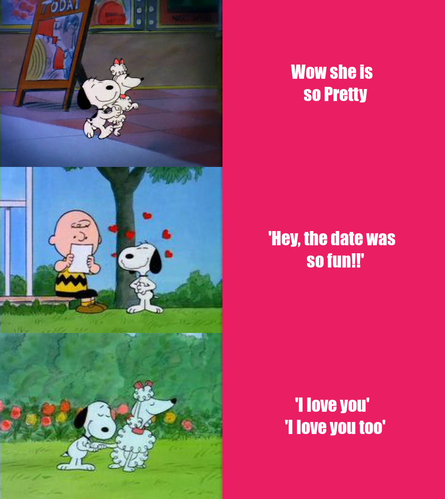

# 💜 STATS220 💜
### *Welcome to my website*

## About me 😊
Hello, my name is Airi, current second year student at the [University of Auckland](https://www.auckland.ac.nz/en.html). 
I am from Japan and I have been in New Zealand since 2019.

## What do I like 💓

* I like play basketball 🏀
* I love Sushi :sushi:
* I like Snoopy 🌟

## Meme 🤪
This is a meme I made using the R package [{magick}](https://cran.r-project.org/web/packages/magick/vignettes/intro.html).

 
## About the meme 💚
* I put 3 images and text for each image to create the cute meme, also I made a **short story** which snoopy liked the one girl and he tells his feeling.
* The **motivation** for this was to show how cute and brave the snoopy is. 
* I used the **panel formats** to create my meme because I thoungt that it is the best way to show and understand what is going on in the story. 
* Snoopy was always one of my favorite character since I was young, so I use snoopy to show off the skills I learnt from the Lectures/Labs.
* my meme is totally **orignal**, meme is usually use funny phrases that spreads from person to person but I wanted make a cute meme so I created a cute story.
* I choose the background color pink so that people easy to see that it is **love story**.

## Image sources 🌟
[the web site](https://peanuts.fandom.com/wiki/Snoopy%27s_Getting_Married,_Charlie_Brown)
## My R code 😃
This is my `R` code I used to make the meme.

```r
library(magick)

# first date
first_image <- image_read("https://static.wikia.nocookie.net/peanuts/images/3/36/GenevieveAndSnoopy.png/revision/latest/scale-to-width-down/640?cb=20130722033523")%>%
  image_scale(500)

# tell his friend about it
second_image <- image_read("https://static.wikia.nocookie.net/peanuts/images/a/ac/Snoopyinlove.jpg/revision/latest/scale-to-width-down/236?cb=20160428132247")%>%
  image_scale(500)

# tell her that he likes her
third_image <- image_read("https://static.wikia.nocookie.net/peanuts/images/3/33/Snoopy_and_girlfriend.jpg/revision/latest/scale-to-width-down/236?cb=20160428132217")%>%
  image_scale(500)

# join the image for the story
story_vector <- c(first_image, second_image, third_image)
story_image <- image_append(story_vector, stack = TRUE)

# first date text
first_text_background <- image_blank(width = "500", 
                                     height = "373", 
                                     color = "#e91e63")%>%
  image_annotate(text = "Wow she is \n so Pretty", 
                 color = "#FFFFFF", 
                 size = "40", 
                 gravity = "center", 
                 font ="Impact")

# tell his friend text
second_text_background <- image_blank(width = "500", 
                                     height = "374", 
                                     color = "#e91e63")%>%
  image_annotate(text = "'Hey, the date was \n so fun!!'", 
                 color = "#FFFFFF", 
                 size = "40", 
                 gravity = "center",
                 font ="Impact")

# tell her I love you text
third_text_background <- image_blank(width = "500", 
                                     height = "374", 
                                     color = "#e91e63")%>%
  image_annotate(text = "'I love you' \n 'I love you too'", 
                 color = "#FFFFFF", 
                 size = "40", 
                 gravity = "center", 
                 font ="Impact")
# join the text
text_background_vector <- c(first_text_background, second_text_background, third_text_background)
text_image <- image_append(text_background_vector, stack = TRUE)

# combined all together
combine_together <- c(story_image, text_image)
meme <- image_append(combine_together)

# saving the image file
image_write(meme,"my_meme.png")
```


